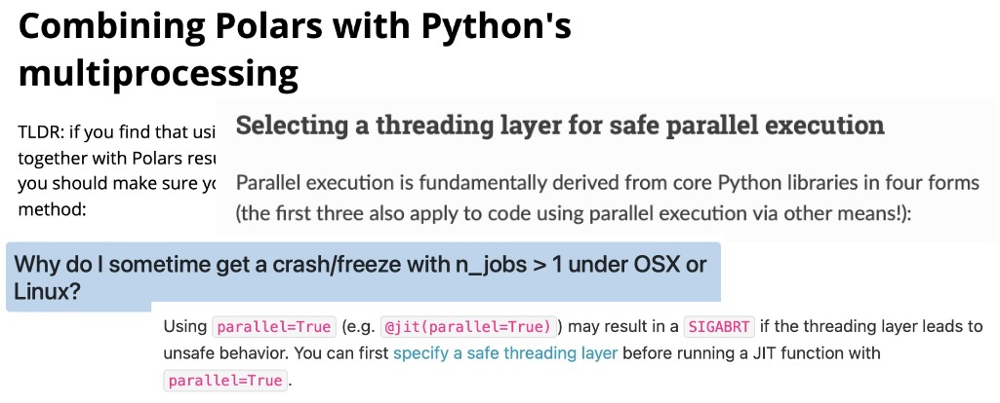
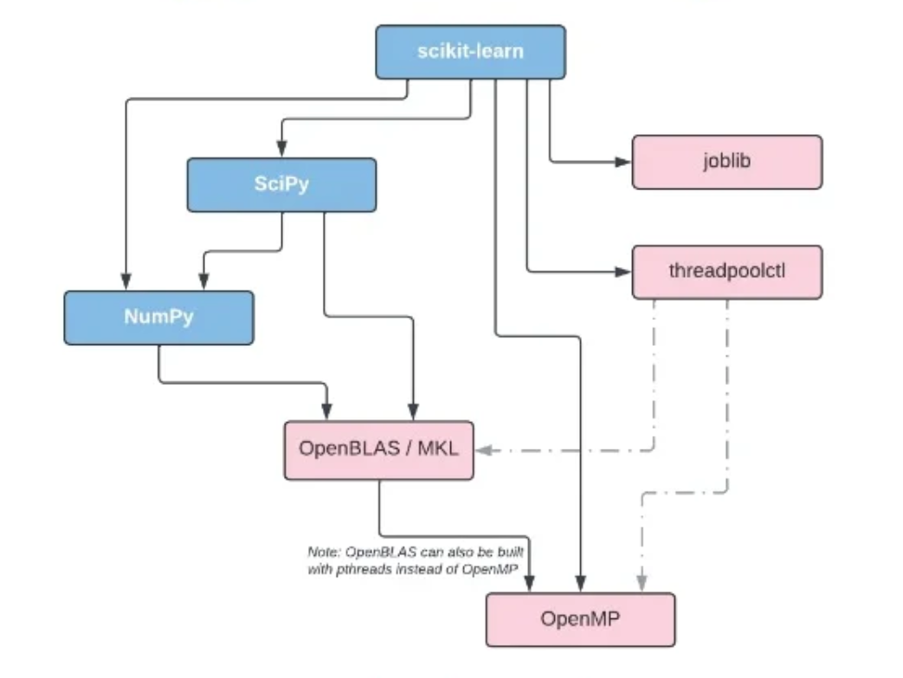

title: Can There Be Too Much Parallelism?
use_katex: False
class: title-slide

# Can There Be Too Much Parallelism?

.larger[Thomas J. Fan]<br>
<a href="https://www.github.com/thomasjpfan" target="_blank" class="title-link"><span class="icon icon-github right-margin"></span>@thomasjpfan</a>
<a class="this-talk-link", href="https://github.com/thomasjpfan/scipy-2023-too-parallel" target="_blank">


This talk on Github: thomasjpfan/scipy-2023-too-parallel</a>

---

class: chapter-slide

# Yes 👀

---

class: center

# User?


---

class: center

# Developer?


---

# My Perspective

.g[
.g-6[
## Parallelism in Scikit-learn
- BLAS through SciPy
- OpenMP
- Python Multi-Threading
- Python Multi-Processing
]
.g-6[

]
]


---

# Scope

.g[
.g-4[

]
.g-4[

]
.g-4[

]
]

---

.center[
# State of Python Parallelism
]

.g.g-middle[
.g-6.larger[
## APIs 💻
## Interactions 🥂
## Defaults 🌈
]
.g-6[

]
]

---

class: center

# APIs 💻


---

.g.g-middle[
.g-8[

# Environment Variables 🌲

.larger[
- **OpenMP**: `OMP_NUM_THREADS`
- **MKL**: `MKL_NUM_THREADS`
- **OpenBLAS**: `OPENBLAS_NUM_THREADS`
- **Rust**: `RAYON_NUM_THREADS`
- **Polars**: `POLARS_MAX_THREADS`
- **Numba**: `NUMBA_NUM_THREADS`
- **macOS accelerate**: `VECLIB_MAXIMUM_THREADS`
- **numexpr**: `NUMEXPR_NUM_THREADS`
]
]
.g-4[

]
]

---

# Global Configuration 🌎

.g.g-middle[
.g-8[
.larger[
- `torch.set_num_threads`
- `numba.set_num_threads`
- `threadpoolctl.threadpool_limits`
- `cv.setNumThreads`
]
]
.g-4[

]
]

---

# Block Configuration 🧱
## `threadpoolctl`

```python
from threadpoolctl import threadpool_limits
import numpy as np

*with threadpool_limits(limits=2):
    a = np.random.randn(1000, 1000)
    a_squared = a @ a
```

---

# Call-site ☎️

.g.g-middle[
.g-8[
.larger[
- **scikit-learn**: `n_jobs`
- **SciPy**: `workers`
- **PyTorch DataLoader**: `num_workers`
- **Python**: `max_workers`
]

]
.g-4[

]
]

---

.g.g-middle[
.g-6[
# APIs 💻
.larger[
- Environment Variables 🌲
- Global Configuration 🌎
- Block Configuration 🧱
- Call-site ☎️
]
]
.g-6.g-center[

]
]


---

class: top

<br><br>

.g[
.g-8[

# Proposal 🔮

<br>

## Common Environment Variable

- Logistically: `OMP_NUM_THREADS`
]
.g-4[

]
]

---

class: top

<br><br>

.g[
.g-8[

# Proposal 🔮

<br>

## Common Environment Variable

- Logistically: `OMP_NUM_THREADS`
- More Agonistic: `GOTO_NUM_THREADS` ☀️
]
.g-4[

]
]

---

# Proposal 🔮

## Recognize more threadpools in `threadpoolctl`

.center[

]

---

# Proposal 🔮

## Agree on Keyword argument at call-sites ☎️

.g[
.g-6[
## Now
- **scikit-learn**: `n_jobs`
- **SciPy**: `workers`
- **PyTorch DataLoader**: `num_workers`
- **Python**: `max_workers`
]
.g-6[
]
]

---

# Proposal 🔮

## Agree on Keyword argument at call-sites ☎️

.g[
.g-6[
## Now
- **scikit-learn**: `n_jobs`
- **SciPy**: `workers`
- **PyTorch DataLoader**: `num_workers`
- **Python**: `max_workers`
]
.g-6[
## Future
- Everyone uses `workers`
]
]

---

class: center

## Interactions 🥂


---

# Oversubscription 💥
## Python + native threading 🐍 + 🧵

```python
from scipy import optimize

optimize.brute(
    computation_that_uses_8_cores, ...
    workers=8
)
```

---

# Current workarounds
## Dask 


[Source](https://docs.dask.org/en/stable/array-best-practices.html#avoid-oversubscribing-threads)

---


[Source](https://docs.ray.io/en/latest/serve/scaling-and-resource-allocation.html#configuring-parallelism-with-omp-num-threads)

---

# PyTorch's DataLoader

.g.g-middle[
.g-8[
```python
from torch.utils.data import DataLoader

dl = DataLoader(..., num_workers=8)

# torch/utils/data/_utils/worker.py
def _worker_loop(...):
    ...
    torch.set_num_threads(1)
```
]
.g-4[

]
]

[Source]()

---

# Proposal: Consistent APIs 🔮

.g[
.g-6[
## Now
```
export OMP_NUM_THREADS=1
export MKL_NUM_THREADS=1
export OPENBLAS_NUM_THREADS=1
export OMP_NUM_THREADS=1
export RAYON_NUM_THREADS=1
export NUMEXPR_NUM_THREADS=1
```
]
.g-6[
]
]

---

# Proposal: Consistent APIs 🔮

.g[
.g-6[
## Now
```
export OMP_NUM_THREADS=1
export MKL_NUM_THREADS=1
export OPENBLAS_NUM_THREADS=1
export OMP_NUM_THREADS=1
export RAYON_NUM_THREADS=1
export NUMEXPR_NUM_THREADS=1
```
]
.g-6[
## Future
```
export GOTO_NUM_THREADS=1
```
]
]

---

class: top

<br><br><br><br>

# Multiple Parallel Abstractions 🧵 + 🧶


- Python multiprocessing using `fork` + GCC OpenMP: **stalls**

--

- Intel OpenMP + LLVM OpenMP on Linux: **stalls**

--

- Multiple OpenBLAS libraries: **sometimes slower**

--

- Read more at: [thomasjpfan.github.io/parallelism-python-libraries-design/](https://thomasjpfan.github.io/parallelism-python-libraries-design/)

---

# Multiple Parallel Abstractions 🧵 + 🧶
## Using more than one parallel backends 🤯



Sources: [polars](https://pola-rs.github.io/polars-book/user-guide/howcani/multiprocessing.html),
[numba](https://numba.pydata.org/numba-doc/latest/user/threading-layer.html),
[scikit-learn](https://scikit-learn.org/stable/faq.html#why-do-i-sometime-get-a-crash-freeze-with-n-jobs-1-under-osx-or-linux),
[pandas](https://pandas.pydata.org/pandas-docs/stable/user_guide/enhancingperf.html#caveats)

---

class: top

<br><br>

# Proposal: Catch issues early 🔮

.g.g-middle[
.g-10[

]
.g-2.center[

]
]
[Source](https://github.com/numba/numba/blob/249c8ff3206928b486346443ec148508f8c25f8e/numba/np/ufunc/omppool.cpp#L119-L121)

--

<br>

## Not a full solution 🩹

---

# Multiple Native threading libraries 🧵 + 🧶

.center[

]

[Source](https://www.slideshare.net/RalfGommers/parallelism-in-a-numpybased-program)

---

# Multiple Native threading libraries 🧵 + 🧶
## CPU Waiting ⏳

```python
for n_iter in range(100):
    UV = U @ V.T             # Use OpenBLAS with pthreads
    compute_with_openmp(UV)  # Use OpenMP
```

[xianyi/OpenBLAS#3187](https://github.com/xianyi/OpenBLAS/issues/3187)

---

# Current Workaround 🩹

.g.g-middle[
.g-6[
## Conda-forge + OpenMP
]
.g-6.center[

]
]

---

# Current Workaround  🩹

.center[

]

[Source](https://www.slideshare.net/RalfGommers/parallelism-in-a-numpybased-program)

---

class: top

# Proposal 🔮

## Ship PyPI wheels for OpenMP


--

## Not a full solution 🩹

.g.g-center.g-middle[
.g-4[

]
.g-4[

]
.g-4[

]
]

---

class: center

# Defaults 🌈


---

class: top

<br><br>

# NumPy

.g.g-middle[
.g-8[
```python
import numpy as np

out = np.sum(A_array, axis=1)
```
]
.g-4.center[

]
]


--

.alert.bold.center[🐌 One Core 🐌]

---

class: top

<br><br>

# NumPy matmul

.g.g-middle[
.g-8[
```python
import numpy as np

out = A_array @ B_array
```
]
.g-4.center[

]
]

--

.success.bold.center[🏎️ All Cores 🏎️]

---

class: top

<br><br><br>

# NumPy matmul (Configuration)

.g[
.g-8[
## Environment variable: `OMP_NUM_THREADS`

```python
out = A_array @ B_array
```
]
.g-4.center[

]
]

---

class: top

<br><br><br>

# NumPy matmul (Configuration)

.g[
.g-8[
## Environment variable: `OMP_NUM_THREADS`

```python
out = A_array @ B_array
```

## `threadpoolctl`

```python
from threadpoolctl import threadpool_limits

with threadpool_limits(limits=1):
    out = A_array @ B_array
```
]
.g-4.center[

]
]

---

class: top

<br>
<br>
<br>
<br>

# PyTorch

.g[
.g-8[
```python
import torch

*out = torch.sum(A_tensor, axis=1)
```
]
.g-4.center[

]
]

--

.success.bold.center[🏎️ All Cores 🏎️]

---

class: top

<br><br>

# PyTorch (Configuration)

.g[
.g-8[
- Environment variable: `OMP_NUM_THREADS`
- `threadpoolctl`

```python
with threadpool_limits(limits=2):
    out = torch.sum(A_tensor, axis=1)
```

- PyTorch function

```python
import torch
*torch.set_num_threads(2)

out = torch.sum(A_tensor, axis=1)
```
]
.g-4.center[

]
]

---

class: top

<br><br><br><br>

# pandas apply

.g[
.g-8[
```python
import pandas as pd
df = pd.DataFrame(np.random.randn(10_000, 100))

*out = roll.mean()
```
]
.g-4.center[

]
]

--

.alert.bold.center[🐌 One Core 🐌]

---

class: top

<br><br>

# pandas apply + numba

.g.g-middle[
.g-8[
```python
import pandas as pd

df = pd.DataFrame(np.random.randn(10_000, 100))

out = roll.mean(
*    engine="numba",
*    engine_kwargs={"parallel": True},
)
```
[Read more](https://pandas.pydata.org/pandas-docs/stable/user_guide/enhancingperf.html#pandas-numba-engine)
]
.g-4.center[

]
]

--

.success.bold.center[🏎️ All Cores 🏎️]

---

# pandas apply + numba (Configuration)

.g[
.g-8[
- Environment variable: `NUMBA_NUM_THREADS`

- Numba function

```python
import numba
*numba.set_num_threads(2)

out = roll.mean(engine="numba", engine_kwargs={"parallel": True})
```
]
.g-4.center[

]
]

---

class: top

<br><br><br>

# LogisticRegression

.g.g-middle[
.g-8[
```python
from sklearn.linear_model import LogisticRegression
log_reg = LogisticRegression().fit(...)

log_reg.predict(X)
```
]
.g-4.center[

]
]

--

.success.bold.center[🏎️ All Cores 🏎️]

---

# LogisticRegression (Configuration)

.g[
.g-8[
- Environment variable: `OMP_NUM_THREADS`
]
.g-4.center[

]
]

---

# LogisticRegression (Configuration)

.g[
.g-8[
- Environment variable: `OMP_NUM_THREADS`

- `threadpoolctl`

```python
*with threadpool_limits(limits=2):
    log_reg.predict(X)
```
]
.g-4.center[

]
]

---

class: top

<br><br><br>

# HistGradientBoostingClassifier

.g[
.g-8[
```python
from sklearn.ensemble import HistGradientBoostingClassifier

hist = HistGradientBoostingClassifier()

hist.fit(X, y)
```
]
.g-4.center[

]
]

--

.success.bold.center[🏎️ All Cores 🏎️]

---

# HistGradientBoostingClassifier (Configuration)

.g[
.g-8[
- Environment variable: `OMP_NUM_THREADS`
]
.g-4.center[

]
]

---

# HistGradientBoostingClassifier (Configuration)

.g[
.g-8[
- Environment variable: `OMP_NUM_THREADS`

- `threadpoolctl`

```python
*with threadpool_limits(limits=2):
    hist.predict(X)
```
]
.g-4.center[

]
]

---

class: top

<br><br><br>

# polars

.g.g-middle[
.g-8[
```python
out = (
    pl.scan_csv(...)
    .filter(pl.col("sepal_length") > 5)
    .groupby("species")
    .agg(pl.col("sepal_width").mean())
    .collect()
)
```
]
.g-4.center[

]
]

--

.success.bold.center[🏎️ All Cores 🏎️]

---

# polars (Configuration)

.g.g-middle[
.g-8[
- Environment variable: `POLARS_MAX_THREADS`

```python
out = (
    pl.scan_csv(...)
    .filter(pl.col("sepal_length") > 5)
    ...
)
```
]
.g-4.center[

]
]

---

class: center

# Defaults 🌈


---

class: center

.g.g-middle[
.g-6[
# Proposal 🔮
## Agree on a default? 😅
]
.g-6[

]
]


---

class: center

# Proposal 🔮
## Libraries document how to configure parallelism


---

.center[
# State of Python Parallelism
]

.g.g-middle[
.g-6.larger[
## APIs 💻
## Interactions 🥂
## Defaults 🌈
]
.g-6[

]
]

---

class: title-slide

# Can There Be Too Much Parallelism?

.larger[Thomas J. Fan]<br>
<a href="https://www.github.com/thomasjpfan" target="_blank" class="title-link"><span class="icon icon-github right-margin"></span>@thomasjpfan</a>
<a class="this-talk-link", href="https://github.com/thomasjpfan/scipy-2023-too-parallel" target="_blank">


This talk on Github: thomasjpfan/scipy-2023-too-parallel</a>
